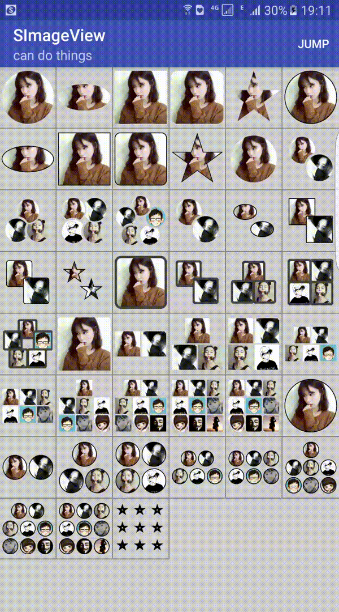

# SImageView
◀️想做一个好厉害的控件


* [控件介绍](#introduction)
* [效果展示](#effect)
* [使用说明](#use)
    * [引用方式](#reference)
    * [xml声明方式](#xml)
    * [代码设置方式](#code)
    * [加载中和加载失败的图片设置](#loading)
    * [控件其他的方法](#other)
    * [设置图片网址匹配](#urlfilter)
    * [类库运行log开关](#log)
* [扩展实现](#expand)
    * [自定义控件measure测量布局排布方式](#measure)
    * [自定义控件的图片显示方式](#display)
    * [缓存策略自定义](#cache)  
* [建议](#note)


<a name="introduction"/> 
## 控件介绍

这是一个简单到`sImageView.setImageUrls("http://img3.cache.netease.com/ent/2009/4/17/20090417104402666a4.jpg");`设置一个网址即可显示图片的控件


相对`ImageView`功能的扩展的控件, 但是没有继承`ImageView`直接继承的`View`. 比如`QQ群组头像`,`微信群组头像`, `设置描边`, `设置圆角矩形头像`,`圆形头像`等. 几个参数搞定.  对于`多个图片的排列`和`图片的具体显示`进行了接口分离. 可以自定义实现任何排列效果和显示效果. 

网络图片的下载会原图缓存磁盘, 并根据控件的大小加载到到内存并使用显示. 


<a name="effect"/> 
## 效果展示

图片可能比较大, 如果不出现, 刷新页面试试或者多等一会.

**可以实现的样式**





<a name="use"/> 
## 使用说明

<a name="reference"/> 
### 引用方式

`rootDir/app/build.gradle文件`


```xml
dependencies {
    // ...
    compile 'com.szysky.customize:simageview:2.2';
}
```
<a name="xml"/> 
### xml声明方式


```xml
<LinearLayout xmlns:android="http://schemas.android.com/apk/res/android"
    xmlns:app="http://schemas.android.com/apk/res-auto"
    android:orientation="vertical"
    android:layout_width="match_parent"
    android:layout_height="match_parent">
    
    <!--简单的配置, 默认为圆形图像,无描边-->
   <com.szysky.customize.siv.SImageView
       xmlns:app="http://schemas.android.com/apk/res-auto"
       app:img="@mipmap/icon_test"
       android:layout_width="200dp"
       android:layout_height="200dp" />
    
    <!--稍微完全的配置范例, 下面会有属性的详细说明-->
    <com.szysky.customize.siv.SImageView
       android:id="@+id/siv_main"
       android:layout_width="match_parent"
       android:layout_height="200dp"
       android:background="@color/colorAccent"
       app:displayType="rect"
       app:border_color="@color/colorPrimary"
       app:border_width="1dp"
       app:img="@mipmap/ic_1"
       app:scaleType="fix_XY"/>
       
</LinearLayout>
```

`属性说明`

* `displayType` 设置控件中的图片要以什么类型显示. 可选值如下:
    * `circle`: 圆形图片. (控件的默认值)
    * `rect`: 矩形图片.
    * `round_rect`: 圆角矩形图片.
    * `oval`: 椭圆形图片
    * `five_pointed_star`: 五角星形图片
* `border_color"` 图片描边颜色. 只有当`border_width>0`的时候才有效. 默认是**黑色**.
* `border_width` 图片描边的宽度. 默认值为`0`, 不显示描边.
* `img` 前景图片, 以上所有的效果, 都是对前景图片进行操作处理.
* `scaleType` 类似于`ImageView`的图片缩放选择. 只有当`displayType="rect"`是矩形, 并且`border_width=0dp`条件下才有效果. 其余场景无意义.可选值如下:
    * `center_inside` : 保持图片的完整性缩放, 可能会留白, 图片比例不变
    * `center_crop`  : 保持控件全部被图片填充. 图片部分可能丢失, 图片比例不变.
    * `fix_XY` : 保持图片的完整性并且控件被全部填充. 图片不会丢失, 不会留白. 图片比例会改变.
    
    
    
    
<a name="code"/>    
### 代码设置形式


**最简单暴力的设置方式**


```java
// 查找控件
SImageView sImageView = (SImageView) findViewById(R.id.siv_main);

// 直接设置一个图片URL即可, 根据控件大小进行内存缓存, 保存原图到本地磁盘缓存
sImageView.setImageUrls("http://img3.cache.netease.com/ent/2009/4/17/20090417104402666a4.jpg");  
                        
```

**关于群组头像**


```java
// 如果你想实现QQ群组效果, 很简单因为默认是圆形类型显示, 不需要多余设置
// 直接传入多个URL, 最多支持5张. 例如
sImageView.setImageUrls(
                        "http://img3.cache.netease.com/ent/2009/4/17/20090417104402666a4.jpg",
                        "http://img3.cache.netease.com/ent/2009/4/17/20090417104402666a4.jpg",
                        "http://img3.cache.netease.com/ent/2009/4/17/20090417104402666a4.jpg",
                        "http://img3.cache.netease.com/ent/2009/4/17/20090417104402666a4.jpg",
                        "http://img3.cache.netease.com/ent/2009/4/17/20090417104402666a4.jpg");
                        
                        
// 需要微信的样式, 那么改一下 布局管理器 , 并设置显示图片类型为 矩形,
// 最多支持9张.  如下
sImageView.setDisplayShape(SImageView.TYPE_RECT)
        .setLayoutManager(new WeChatLayoutManager(getApplicationContext()))
        .setImageUrls(
              "http://img3.cache.netease.com/ent/2009/4/17/20090417104402666a4.jpg",
              "http://img3.cache.netease.com/ent/2009/4/17/20090417104402666a4.jpg",
              "http://img3.cache.netease.com/ent/2009/4/17/20090417104402666a4.jpg",
              "http://img3.cache.netease.com/ent/2009/4/17/20090417104402666a4.jpg",
              "http://img3.cache.netease.com/ent/2009/4/17/20090417104402666a4.jpg");
```


**以下是常用方法** 

```java
SImageView sImageView = (SImageView) itemView.findViewById(R.id.siv);

// 设置描边颜色
sImageView.setBorderColor(Color.GREEN);

// 设置描边宽度 单位dp值
sImageView.setBorderWidth(1);

 // 设置图片显示类型 
 // 可设置类型: SImageView.TYPE_CIRCLE(默认), SImageView.TYPE_OVAL,     
 //           SImageView.TYPE_RECT, SImageView.TYPE_ROUND_RECT, 
 //           SImageView.TYPE_FIVE_POINTED_STAR
 sImageView.setDisplayShape(SImageView.TYPE_ROUND_RECT);
 
 // 设置图片的缩放类型, 只有显示类型为矩形, 并且描边宽度为0. 才有效果. 区别在xml中有说明
 // 可选类型3种:SCALE_TYPE_CENTER_INSIDE(默认), 
 //           SCALE_TYPE_FIX_XY ,SCALE_TYPE_CENTER_CROP
 mSImageView.setScaleType(SImageView.SCALE_TYPE_CENTER_INSIDE);
 
 // 设置微信群组样式显示.  (可以自定义measure测量排列规则)替换measure测量策略如下:
 // 默认为qq群组的测量策略. 只要设置图片时传入多张图片的集合即可.
sImageView.setLayoutManager(new WeChatLayoutManager(context));

// 不仅可以设置url数组, 还支持其他设置图片方式
sImageView.setImages(List<Bitmap>); // 接收一个bitmap集合, 实现qq群组或者微信群组效果
sImageView.setIdRes(id);            // 接收图片资源id
sImageView.setDrawable(Drawable);   // 接收一个Drawable对象
sImageView.setBitmap(Bitmap);       // 接收一个图片的bitmap

```

<a name="loading"/> 
### 加载中的图片和加载失败的图片设置

对于网络下载图片. 会有**下载失败**和**下载中**的图片显示. 默认图片加载类`ImageLoad`类中会内置两张系统两个对应图片来显示. `ImageLoad`类中的`加载中`和`加载失败`图片会作用于全局的`SImageView`控件. 也可以给`SImageView`控件实例设置. 如果控件设置了. 那么优先级会比全局`ImageLoad`中的图片使用优先. 如果控件没有, 那么就使用全局. 

代码设置如下:


```java

// 设置当前控件的场景图片, 优先级高于全局
sImageView.setErrPicResID(R.mipmap.ic_launcher)     // 设置加载错误图片
        .setLoadingResID(R.mipmap.icon_test)        // 设置加载中图片
        .setImageUrls("http://xxx.jpg");            // 图片故意填写一个错误
        
        
// 对于图片网址满足条件 判断正则为: "https?://.*?.(jpg|png|bmp|jpeg|gif)"
//如果不满足, 那么会认为是一个错误地址, 可动态配置, 后面说明


// 设置全局控件场景图片, (有默认图片可以不设置)
ImageLoader.getInstance(getApplicationContext()).setLoadErrResId(R.mipmap.icon_test);       ImageLoader.getInstance(getApplicationContext()).setLoadingResId(R.mipmap.ic_launcher);
```


<a name="other"/> 
### 控件其他的方法

| 方法名称 | 参数说明| 方法作用 |
|---|---|---|
|`setCloseNormalOnePicLoad()`|布尔值|设置`true`可以强制关闭一张图片时候的默认单张图片处理规则, 而由`测量接口`,`绘制显示接口`处理.|
|`setOvalRatio()`|float类型, 椭圆的宽高比值(必须大于0)|在`单张图片`并且`椭圆类型`显示时, 设置椭圆的显示的宽高比例|
|`setRectRoundRadius()`|float类型, 设置范围0~2,默认1|在`单张图片`并且`圆角矩形类型`显示时, 设置圆角的弧度大小|
|`setDrawStrategy()`||可参考下面的扩展实现, 用来设置自定义图片实现策略|
|`setLayoutManager()`||可参考下面的扩展实现, 用来设置自定义或替换 图片的排列分布规则|

对应的`getter()`方法省略. 


<a name="urlfilter"/> 
### 设置图片网址匹配

上面提到过默认过滤图片链接的正则判断为`"https?://.*?.(jpg|png|bmp|jpeg|gif)"`

如果需要实现其他的地址规则. 可重定义过滤策略


```java
ImageLoader.getInstance(getApplicationContext()).setPicUrlRegex("RegexStr");

// 如果设置自定义正则之后需要恢复, 那么直接设置空串即可
ImageLoader.getInstance(getApplicationContext()).setPicUrlRegex("");
```

<a name="log"/> 
### 输出log开关

默认类库`log`是不输出的, 如果需要打开如下:


```java
LogUtil.GlobalLogPrint = true;      // 输出类库相关log信息
```


<a name="expand"/> 
## 扩展实现

> 控件实现了`measure测量布局`和`draw具体绘图实现`的功能分离. 你可以任意实现排列规则, 和具体的绘图显示的规则. 

<a name="measure"/> 
### 自定义measure测量布局

布局测量接口`ILayoutManager`. 相当于`RecyclerView`设置布局管理器. 或者`View#onMeasure()`的作用. 

目前内置了2种布局来实现多张图片的排列.

* `QQLayoutManager`: 控件默认排列规则, 效果类似于`qq群组头像`,最大支持`5`张图片
* `WeChatLayoutManager`: 效果类似于`微信群组头像`, 最大支持`9`张图片

通过`setLayoutManager(ILayoutManager)`来进行测量规则的具体实现类. 

默认情况下, 如果控件只设置了一张图片是不会走`测量的流程`. 如果需要一张图片时也需要不规则的排布. 那么通过`SImageView#setCloseNormalOnePicLoad(true)`. 强制关闭. 

自定义实现: 实现`ILayoutManager`接口并在`calculate()`实现具体的排列效果. 并返回一个子图片的位置信息集合. 接口如下. 可参考已经实现的两个类.


```java
public interface ILayoutManager {

    /**
     * 布局measure排列计算方法, 具体规则由子类实现
     *
     * @param viewWidth 控件的宽
     * @param viewHeight 控件的高
     * @param viewNum   控件图片的数量
     * @return  返回一个信息集合, 提供 {@link com.szysky.customize.siv.effect.IDrawingStrategy#algorithm(Canvas, int, int, Bitmap, SImageView.ConfigInfo)}使用
     */
    ArrayList<LayoutInfoGroup> calculate(int viewWidth, int viewHeight, int viewNum);


    /**
     * 封装控件内部单个元素显示的布局信息
     */
    class LayoutInfoGroup implements Cloneable{
        /**
         * 组合头像时, 每个单独元素可分配的最大宽高
         */
        public int innerWidth;
        public int innerHeight;

        /**
         * 每个单独元素,左上点和右下点.   可规划区域
         */
        public Point leftTopPoint = new Point();
        public Point rightBottomPoint = new Point();

        @Override
        protected Object clone() throws CloneNotSupportedException {
            LayoutInfoGroup clone = (LayoutInfoGroup) super.clone();
            clone.leftTopPoint.set(leftTopPoint.x, leftTopPoint.y);
            clone.rightBottomPoint.set(rightBottomPoint.x, rightBottomPoint.y);

            return clone;
        }
    }
}
```

<a name="display"/> 
### 自定义的图片显示

控件内置了两种图片显示. 例如: 椭圆, 圆角矩形, 描边, 五角星等. 相当于`View#onDraw()`和`Adapter#getView()`作用. 具体显示分离. 

绘制显示接口`IDrawingStrategy`

内置实现:

* `NormalOnePicStrategy`: 当控件设置单张图片时, 默认都是正中间(矩形除外, 保留了`ImageView`三种常用的缩放). 所以无需进行测量步骤. 直接通过配置的形状属性等进行相对应的配置实现效果. 
* `ConcreteDrawingStrategy`: 当控件图片为多张的时被触发. 接收`ILayoutManager#calculate()`测量布局返回的子图片的信息集合, 进行具体的绘制工作. 可通过`SImageView#setCloseNormalOnePicLoad(true)`强制关闭控件单张图片执行`NormalOnePicStrategy`的逻辑. 全权由`测量布局`,`绘制显示`两个逻辑实现所有图片数量的处理.

 
通过`setDrawStrategy(IDrawingStrategy)`来进行图片绘制显示的具体策略类.

自定义绘制策略类. 实现`IDrawingStrategy`接口并实现对应方法, 方法里面有图片对应的画布,和需要显示的宽高信息等.  接口如下:


```java
public interface IDrawingStrategy {
    /**
     * 根据提供的画布, 和可绘制的位置实现具体效果
     *
     * @param canvas    {@link SImageView#onDraw(Canvas)} 中的画布
     * @param childTotal 图片的总个数
     * @param curChild  当前图片是第几张图片                  
     * @param opeBitmap 需要操作的图片                                                  
     * @param info      每个内部元素应该摆放的位置信息类
     */
    void algorithm(Canvas canvas, int childTotal, int curChild, Bitmap opeBitmap, SImageView.ConfigInfo info);
}
```


<a name="cache"/> 
### 缓存策略自定义

这部分写的自己不是很满意, 写着写着就有点耦合了, 最后精力不够... 好吧这是借口.  反正也能将就自定义, 用默认的就行.... [捂脸]


## 建议

* 尽量使控件作为头像控件显示, 如果大小低于`100dp`, 内部稍微做了一些特别处理. 性能可以好一些.
* 由于内置样式较多, 导致了`cpu密集处理`. 和一些对象的开销. 如果项目性能要求较高那么可通过自定义绘图策略注入控件来优化. 这样项目中常用的效果就可以得到性能提升.
* 类库需要`写外部存储的权限`, 对于新版本的`动态权限`, 一定要先进行权限判断, 再对`ImageLoad`进行初始化(控件的网络图片设置). 否则可能导致, 磁盘缓存无效只有内存缓存. 


> 如果发现什么问题, 请提`issue`. 作者会抽时间去修补 ^*^.  
> 如果看着还不错. 那么`star`一下吧.

`end`


